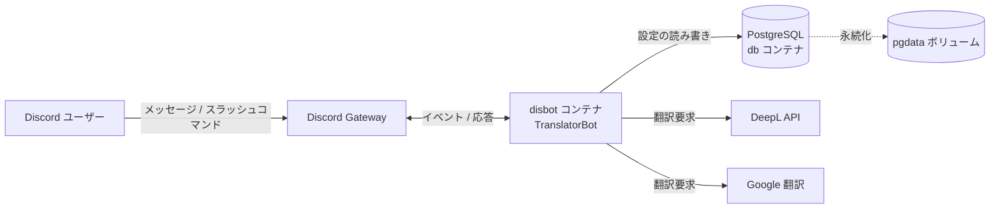
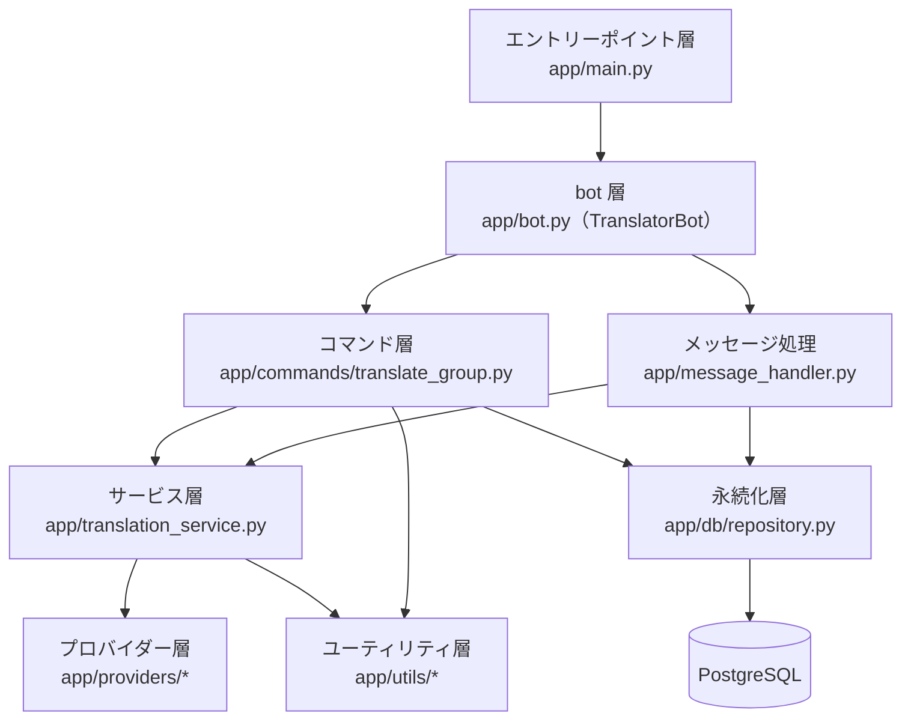
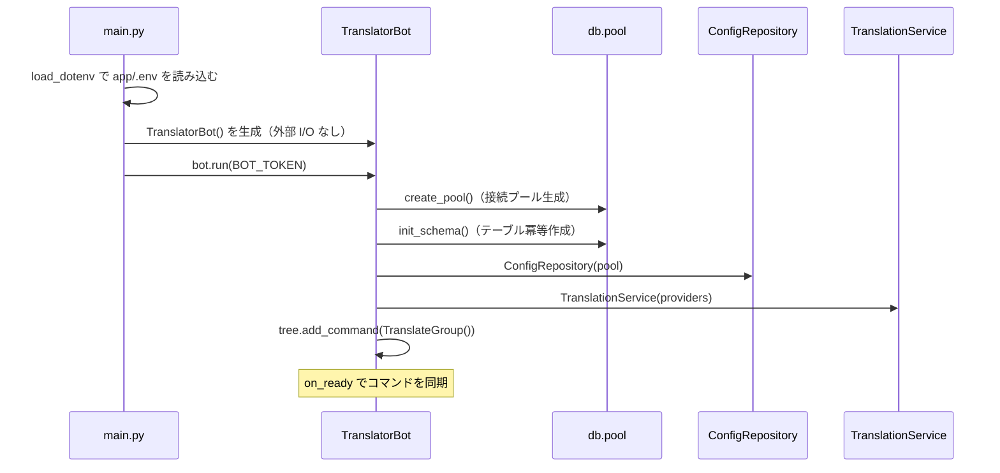
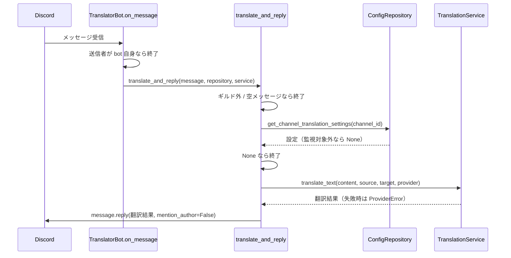

# アーキテクチャ
システム全体の構成、レイヤー間の関係、および主要な処理フローを示す。

## システム全体の構成
bot は Docker Compose の `disbot` サービスとして動作し、`db` サービス（PostgreSQL）と外部の翻訳 API に依存する。全体構成を次に示す。

## レイヤー構成
レイヤードアーキテクチャを採用し、各レイヤーの責務を分離する。上位レイヤーは下位レイヤーに依存する。

各レイヤーの責務は次のとおりである。

- エントリーポイント層: 環境変数を読み込み、`TranslatorBot` を生成して起動する（`app/main.py`）。
- bot 層: Discord イベントを受け取り、`setup_hook` で依存（接続プール、リポジトリ、翻訳サービス、コマンドツリー）を初期化する（`app/bot.py`）。
- コマンド層: スラッシュコマンドを定義し、リポジトリと翻訳サービスへ委譲する（`app/commands/translate_group.py`）。
- メッセージ処理: 監視対象メッセージを翻訳して返信する純粋な関数を提供する（`app/message_handler.py`）。
- サービス層: Markdown 保護、プロバイダー呼び出し、復元からなる翻訳パイプラインを提供する（`app/translation_service.py`）。
- プロバイダー層: 翻訳エンジンを `Provider` 抽象で統一する（`app/providers/`）。
- 永続化層: 設定の CRUD（作成、参照、更新、削除）を提供する（`app/db/repository.py`）。
- ユーティリティ層: Markdown 保護と権限チェックを提供する（`app/utils/`）。

## 初期化フロー
外部 I/O を伴う初期化は同期コンストラクタではなく、discord.py の非同期フック `setup_hook` で行う。起動から初期化完了までの流れを次に示す。

## メッセージ翻訳フロー
`on_message` は監視対象チャンネルのメッセージを翻訳して返信する。処理の分岐を次に示す。

翻訳失敗（`ProviderError`）や返信失敗（`discord.HTTPException`）は警告ログを出力して握りつぶし、ユーザーへは通知しない（`app/message_handler.py:46-63`）。

## コマンド処理フロー
スラッシュコマンドは `interaction.client`（`TranslatorBot` 実体）経由でリポジトリと翻訳サービスにアクセスする。権限チェックは `app_commands.check` デコレータで行い、失敗時は共通エラーハンドラ `handle_app_command_error` が日本語メッセージを返す（`app/commands/translate_group.py:509-529`）。詳細は [コアコンポーネント](./06-コアコンポーネント.md) と [コマンドリファレンス](./08-コマンドリファレンス.md) を参照する。
