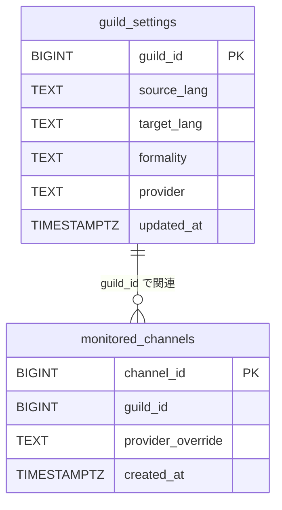

# データモデル
PostgreSQL のテーブル定義、テーブル間の関係、およびアプリケーション側のデータクラスを示す。スキーマは bot 起動時に冪等に作成する（`app/db/pool.py`）。

## テーブル一覧
2つのテーブルを使用する。設定はギルド単位、監視対象はチャンネル単位で保持する。

| テーブル | 主キー | 役割 |
| --- | --- | --- |
| `guild_settings` | `guild_id` | ギルド単位の翻訳設定 |
| `monitored_channels` | `channel_id` | 監視対象チャンネルとプロバイダー上書き |

## テーブル構造
各テーブルのカラム定義を示す。定義は `app/db/pool.py:22-45` に基づく。

### guild_settings
ギルド単位の翻訳設定を保持する。行が存在しない場合はアプリケーション側の既定値を用いる。

| カラム | 型 | 制約・既定値 | 説明 |
| --- | --- | --- | --- |
| `guild_id` | `BIGINT` | 主キー | ギルドID |
| `source_lang` | `TEXT` | `NOT NULL DEFAULT 'EN'` | 翻訳元言語コード |
| `target_lang` | `TEXT` | `NOT NULL DEFAULT 'JA'` | 翻訳先言語コード |
| `formality` | `TEXT` | `NOT NULL DEFAULT 'more'` | 敬語レベル |
| `provider` | `TEXT` | `NOT NULL DEFAULT 'deepl'` | 既定翻訳プロバイダー名 |
| `updated_at` | `TIMESTAMPTZ` | `NOT NULL DEFAULT now()` | 更新日時 |

### monitored_channels
監視対象チャンネルを保持する。チャンネル単位でプロバイダーを上書きできる。

| カラム | 型 | 制約・既定値 | 説明 |
| --- | --- | --- | --- |
| `channel_id` | `BIGINT` | 主キー | チャンネルID |
| `guild_id` | `BIGINT` | `NOT NULL` | 所属ギルドID |
| `provider_override` | `TEXT` | NULL 許可 | チャンネル単位のプロバイダー上書き。NULL の場合はギルド既定を用いる |
| `created_at` | `TIMESTAMPTZ` | `NOT NULL DEFAULT now()` | 追加日時 |

`guild_id` には検索用のインデックス `idx_monitored_channels_guild_id` を作成する（`app/db/pool.py:41-44`）。

## ER図
テーブル間の論理的な関係を次に示す。外部キー制約は定義しておらず、`guild_id` による論理的な関連である。

## プロバイダーの解決順位
翻訳プロバイダーは、チャンネル上書きとギルド既定の2段階で解決する。`get_channel_translation_settings` は `monitored_channels` と `guild_settings` を1回のクエリで結合し、`COALESCE` で優先順位を解決する（`app/db/repository.py:55-73`）。

解決順位は次のとおりである。

1. `monitored_channels.provider_override`（チャンネル上書き）
2. `guild_settings.provider`（ギルド既定）
3. アプリケーション側の既定値 `deepl`（`DEFAULT_PROVIDER`）

言語と敬語レベルも同様に、ギルド行が無い場合は既定値（`EN` / `JA` / `more`）へフォールバックする。

## データクラス
リポジトリは行を不変（`frozen=True`）のデータクラスとして返す（`app/db/models.py`）。

### GuildSettings
`guild_settings` の1行、または行が存在しない場合の既定値を表す。

| 属性 | 型 | 説明 |
| --- | --- | --- |
| `guild_id` | `int` | ギルドID |
| `source_lang` | `str` | 翻訳元言語コード |
| `target_lang` | `str` | 翻訳先言語コード |
| `formality` | `str` | 敬語レベル |
| `provider` | `str` | 既定翻訳プロバイダー名 |

### ChannelTranslationSettings
監視チャンネルの解決済み翻訳設定を表す。`on_message` のホットパスで使用する。`provider` はチャンネル上書きとギルド既定を解決済みの値である。

| 属性 | 型 | 説明 |
| --- | --- | --- |
| `channel_id` | `int` | チャンネルID |
| `guild_id` | `int` | 所属ギルドID |
| `source_lang` | `str` | 翻訳元言語コード |
| `target_lang` | `str` | 翻訳先言語コード |
| `formality` | `str` | 敬語レベル |
| `provider` | `str` | 解決済みの翻訳プロバイダー名 |

## 既定値と敬語レベルの候補
既定値と敬語レベルの取り得る値を次に示す。

- 既定値（`app/db/repository.py:20-23`）: `source_lang=EN`、`target_lang=JA`、`formality=more`、`provider=deepl`。
- 敬語レベルの候補（`app/commands/translate_group.py:29`）: `default`、`more`、`less`、`prefer_more`、`prefer_less`。

敬語レベルはデータベースに保存されるが、現在の翻訳呼び出しには渡していない。値は設定の表示（`/translate config show`）に用いる。プロバイダーへの引き渡しは未実装であり、今後の拡張余地である（[まとめ](./11-まとめ.md) を参照）。
